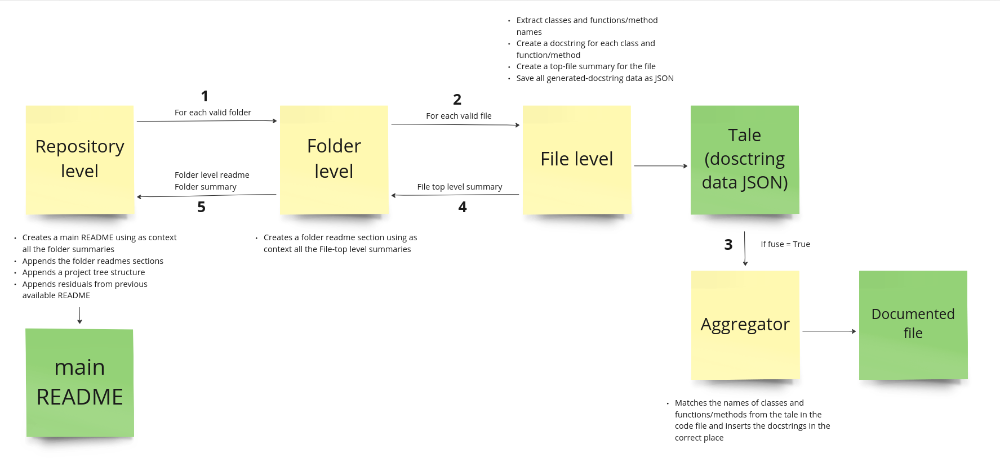

# devtale

Every software product depends on some legacy, undocumented code repositories, whose authors left the company years ago.

Who isn't afraid to make a change, if the code is unreadable?

`devtale` generates repo documentation with LLMs. Currently supporting Python, Go, PHP, JS, TypeScript and React projects.

https://github.com/mystral-ai/devtale/assets/11546115/e3cb1354-d9ef-406f-90d7-e92576587549

## Installation

Use the following command:

```bash
python setup.py install
```

## Usage

### Terminal

> Note: currently, devtale only supports GPT-4 as LLM.

- Create a `.env` file in the root directory and set your `OPENAI_API_KEY` there.

- Run the following command to document a file or document all the files in a folder:

```bash
devtale -p [path/to/your/code] -o [path/to/docs]
```

To document an entire repository/directory include the `-r` (recursive) flag. The program generates a JSON file per code file with the documentation data; If you want to also add the documentation inside a copy of the code file, then please include the `-f` (fuse) flag. In case you already have the JSON docstrings, you can also fuse them separately using the corresponding [script](scripts/)

### Workflow

> Note: You must check the box _"Allow GitHub Actions to create and approve pull requests"_ in your repository's setting -> actions for this to work.

- In the repository setting -> Secrets and Variables -> Actions -> Create `OPENAI_API_KEY` repository secret

- Add the following step in your workflow. Ensure to specify the write permission to avoid 403 errors when attempting to push the devtale PR.

```bash
jobs:
  code-documentation:
    runs-on: ubuntu-latest
    permissions: write-all
    steps:
      - name: Document
        uses: mystral-ai/devtale@v0.1.2
        with:
          OPENAI_API_KEY: ${{ secrets.OPENAI_API_KEY }}
          path: ${{ github.workspace }}
          recursive: true
          target_branch: main
          save_tales: false
```

The `recursive` option allows you to document the entire repository. Alternatively, you can specify a specific path to document a single file or folder and set `recursive` to `false`. The workflow action will automatically create the `devtale/documentation` branch and push a new pull request for your review towards the `target_branch`, including the added documentation.

## Cost

You can estimate project documentation costs using the `--estimate` flag when using the `devtale` command in terminal, which won't make any GPT calls. Please note that this estimate is approximate, as it doesn't include GPT output tokens nor code items JSON tokens generated by the GPT call in the `devtale/utils.py/extract_code_elements` function.

If you skip the estimate and simply run 'devtale,' the final log will display the total cost. This total cost considers GPT output tokens and the tokens added by the code items JSON.

For example:

Running the following command:

```bash
devtale -r -f -p devtale/devtale --estimate
```

will provide you with a cost estimate of $2.44733 USD. It won't document anything since it doesn't trigger any GPT calls. On the other hand, running:

```bash
devtale -r -f -p devtale/devtale
```

will give you the total cost of $2.95762 USD. This command triggers GPT calls and, consequently, documents the directory.

## Dependency on GPT-4

We found that `GPT-3.5` can't extract code components and generate docstring in a reliable manner, while `GPT-4` can do so. Hence, devtale currently only works with `GPT-4`. Beware that the cost associated with running devtale on a large code repository may be prohibitive. To reduce this cost, devtale uses `text-davinci-003` for generating top-level file summaries and README files.

## Pipeline

In a high-level overview, devtale works in the following way:


